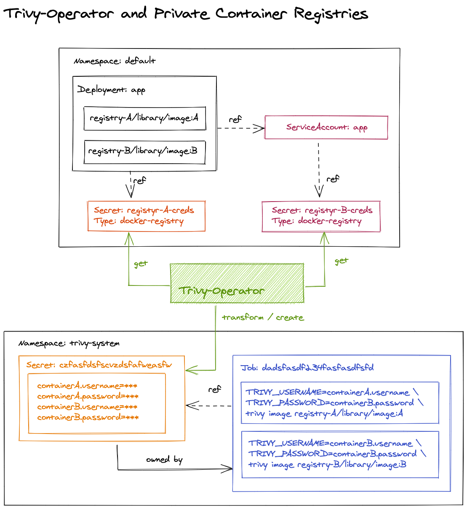

## Downloading Trivy-DB and Trivy-java-DB from private registries
By design, the operator does not allow setting different usernames and passwords for multiple registries. 
Therefore, when downloading trivy-db and trivy-java-db from repositories that require authentication, 
you must use the same registry for both. 
Authentication will use the registry specified in the `trivy.dbRepository` field.

## Image Pull Secrets

1. Find references to image pull secrets (direct references and via service account).
2. Create the temporary secret with basic credentials for each container of the scanned workload.
3. Create the scan job that references the temporary secret. The secret has the ownerReference property set to point to the job.
4. Watch the job until it's completed or failed.
5. Parse logs and save vulnerability reports in etcd.
6. Delete the job. The temporary secret will be deleted by the Kubernetes garbage collector.

For more details, please check out the tutorial [on using private registries](../../tutorials/private-registries.md).