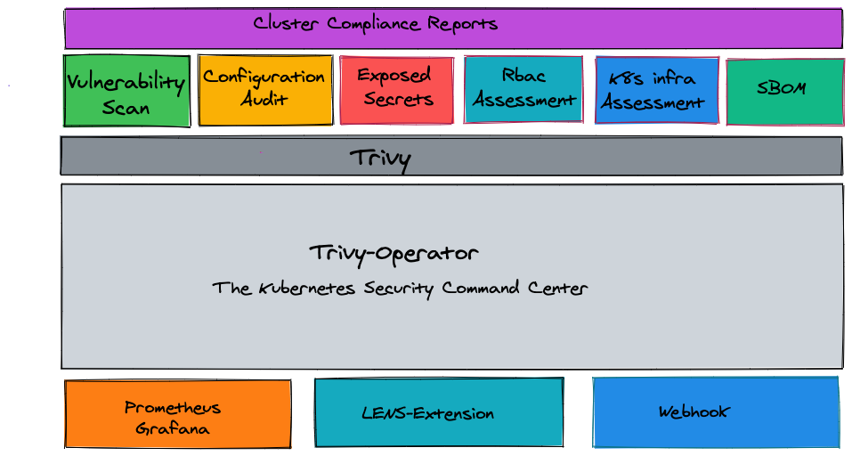

# Trivy Operator Overview

The Trivy Operator leverages [Trivy](https://github.com/aquasecurity/trivy) to continuously scan your Kubernetes cluster for security issues. The scans are summarised in security reports as Kubernetes [Custom Resource Definitions], which become accessible through the Kubernetes API. The Operator does this by watching Kubernetes for state changes and automatically triggering security scans in response. For example, a vulnerability scan is initiated when a new Pod is created.
This way, users can find and view the risks that relate to different resources in a `Kubernetes-native` way.

## In-cluster Security Scans

The Trivy Operator automatically generates and updates security reports. These reports are generated in response to new workload and other changes on a Kubernetes cluster, generating the following reports:

- Vulnerability Scans: Automated vulnerability scanning for Kubernetes workloads.
- ConfigAudit Scans: Automated configuration audits for Kubernetes resources with predefined rules or custom Open Policy Agent (OPA) policies.
- Exposed Secret Scans: Automated secret scans which find and detail the location of exposed Secrets within your cluster.
- RBAC scans: Role Based Access Control scans provide detailed information on the access rights of the different resources installed.
- K8s core component infra assessment scan Kubernetes infra core components (etcd,apiserver,scheduler,controller-manager and etc) setting and configuration.
- k8s outdated api validation - a configaudit check will validate if the resource api has been deprecated and planned for removal
- Compliance reports
  - NSA, CISA Kubernetes Hardening Guidance v1.1 cybersecurity technical report is produced.
  - CIS Kubernetes Benchmark v1.23 cybersecurity technical report is produced.
  - Kubernetes pss-baseline, Pod Security Standards
  - Kubernetes pss-restricted, Pod Security Standards
- SBOM (Software Bill of Materials generations) for Kubernetes workloads.

<p align="center">

</p>

_Please [star ⭐](https://github.com/aquasecurity/trivy-operator/stargazers) the repo if you want us to continue developing and improving trivy-operator! 😀_

## Usage

The official [Documentation] provides detailed installation, configuration, troubleshooting, and quick start guides.

You can install the Trivy-operator Operator with [Static YAML Manifests] and follow the [Getting Started][getting-started-operator]
guide to see how vulnerability and configuration audit reports are generated automatically.

### Quick Start

The Trivy Operator can be installed easily through the [Helm Chart](./getting-started/installation/helm.md).
The Helm Chart can be downloaded by one of the two options:

#### Option 1: Install from traditional helm chart repository

Add the Aqua chart repository:

```sh
   helm repo add aqua https://aquasecurity.github.io/helm-charts/
   helm repo update
```

Install the Helm Chart:

```sh
   helm install trivy-operator aqua/trivy-operator \
     --namespace trivy-system \
     --create-namespace \
     --version {{ var.chart_version }}
```

#### Option 2: Install from OCI registry (supported in Helm v3.8.0+)

Install the Helm Chart:

```sh
   helm install trivy-operator oci://ghcr.io/aquasecurity/helm-charts/trivy-operator \
     --namespace trivy-system \
     --create-namespace \
     --version 0.21.4
```

This will install the Trivy Helm Chart into the `trivy-system` namespace and start triggering the scans.

## Status

Although we are trying to keep new releases backward compatible with previous versions, this project is still incubating,
and some APIs and [Custom Resource Definitions] may change.

## Contributing

At this early stage we would love your feedback on the overall concept of Trivy-Operator. Over time, we'd love to see
contributions integrating different security tools so that users can access security information in standard,
Kubernetes-native ways.

- See [Contributing] for information about setting up your development environment, and the contribution workflow that
  we expect.
- Please ensure that you are following our [Code Of Conduct](https://github.com/aquasecurity/community/blob/main/CODE_OF_CONDUCT.md) during any interaction with the Aqua projects and their community.

---
Trivy-Operator is an [Aqua Security](https://aquasec.com) open source project.  
Learn about our [Open Source Work and Portfolio].  
Join the community, and talk to us about any matter in [GitHub Discussions] or [Slack].

[Contributing]: https://github.com/aquasecurity/trivy-operator/blob/main/CONTRIBUTING.md
[GitHub Discussions]: https://github.com/aquasecurity/trivy-operator/discussions
[Slack]: https://slack.aquasec.com/
[Open Source Work and Portfolio]: https://www.aquasec.com/products/open-source-projects/

[Custom Resource Definitions]: https://aquasecurity.github.io/trivy-operator/latest/docs/crds/
[Documentation]: https://aquasecurity.github.io/trivy-operator/latest
[Static YAML Manifests]: https://aquasecurity.github.io/trivy-operator/latest/getting-started/installation/kubectl/
[getting-started-operator]: https://aquasecurity.github.io/trivy-operator/latest/
