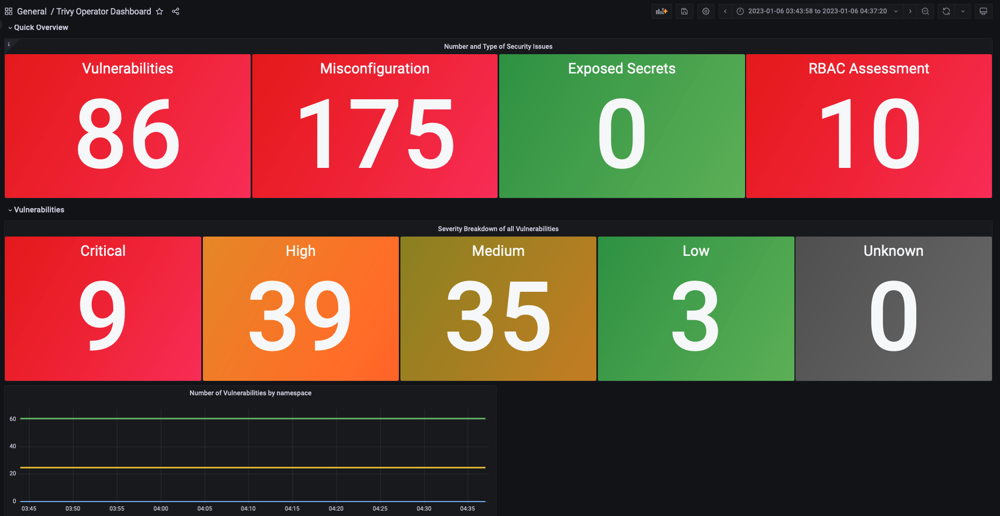

## Accessing Trivy Operator Metrics through a Grafana Dashboard

In this tutorial, we showcase how you can access the metrics from your Trivy Operator reports through Grafana.

### Prerequisites

* The Helm CLI installed
* Access a Kubernetes cluster through kubectl (any cluster will do, however, if you use microk8s or another local Kubernetes cluster, you need to make sure DNS is enabled. Most providers will have a guide on how to enable it.)

### Installing Prometheus and Grafana

Prometheus and Grafana can easily be installed through the kube-prometheus-stack [Helm Chart.](https://github.com/prometheus-community/helm-charts/tree/main/charts/kube-prometheus-stack)

First, create a `monitoring` namespace in which we can install the Prometheus & Grafana resources:

```
kubectl create ns monitoring
```

Add the chart to your Helm CLI:

```
helm repo add prometheus-community https://prometheus-community.github.io/helm-charts
```

Then update your charts to access the latest versions:

```
helm repo update
```

Our Prometheus installation needs to be slightly customised to discover ServiceMonitors by default. Create a values.yaml file with the following configuration:

```
prometheus:
  prometheusSpec:
    serviceMonitorSelectorNilUsesHelmValues: false
    serviceMonitorSelector: {}
    serviceMonitorNamespaceSelector: {}
```

If you are working on a more complex installation or you would like the Helm Chart to connect with other applications such as Promtail or other monitoring tools, the values.yaml file is a good place to set up those configuration.

Next, install the Helm Chart:

```
helm upgrade --install prom prometheus-community/kube-prometheus-stack -n monitoring --values values.yaml
```

Note that if your values.yaml file is saved in a different directory than your current directory, then please modify its path.

You should see a success message upon installation similar to the following:

```
Release "prom" does not exist. Installing it now.
NAME: prom
LAST DEPLOYED: Fri Nov 25 11:21:24 2022
NAMESPACE: monitoring
STATUS: deployed
REVISION: 1
NOTES:
kube-prometheus-stack has been installed. Check its status by running:
  kubectl --namespace monitoring get pods -l "release=prom"

Visit https://github.com/prometheus-operator/kube-prometheus for instructions on how to create & configure Alertmanager and Prometheus instances using the Operator.
```

### Installing the Trivy Operator Helm Chart

In this section, we will install the Trivy Operator Helm Chart. The commands are provided in the [documentation](https://aquasecurity.github.io/trivy-operator/v0.7.1/operator/installation/helm/).

```
helm repo add aqua https://aquasecurity.github.io/helm-charts/
helm repo update
```

Before we install the operator, we will need to create a values.yaml file for Trivy with some slight changes to the Helm installation:

```
serviceMonitor:
  # enabled determines whether a serviceMonitor should be deployed
  enabled: true
trivy:
  ignoreUnfixed: true
service:
  # disabled ensures that the pod gets a ClusterIP.
  headless: false    
```

In the changes above, we tell the Trivy Helm Chart to first, enable the ServiceMonitor and then to ignore all vulnerabilities that do not have a fix available yet. The ServiceMonitor is required to allow Prometheus to discover the Trivy Operator Service and scrape its metrics.

Next, we can install the operator with the following command:

```
helm install trivy-operator aqua/trivy-operator \
  --namespace trivy-system \
  --create-namespace \
  --version {{ var.chart_version }} \
  --values trivy-values.yaml
```

Or install the chart **using the OCI registry**:

```sh
helm install trivy-operator oci://ghcr.io/aquasecurity/helm-charts/trivy-operator \
  --namespace trivy-system \
  --create-namespace \
  --version {{ var.chart_version }} \
  --values trivy-values.yaml
```


Ensure that you can see the following success message:

```
NAME: trivy-operator
LAST DEPLOYED: Fri Nov 25 12:46:35 2022
NAMESPACE: trivy-system
STATUS: deployed
REVISION: 1
TEST SUITE: None
NOTES:
You have installed Trivy Operator in the trivy-system namespace.
It is configured to discover Kubernetes workloads and resources in
all namespace(s).
```

### Open the Prometheus and the Grafana Dashboard

With the following command, you can access the Prometheus Dashboard:

```
kubectl port-forward service/prom-kube-prometheus-stack-prometheus -n monitoring 9090:9090
```

Next, open a new terminal and access the Grafana Dashboard:

```
kubectl port-forward service/prom-grafana -n monitoring 3000:80
```

### Access Trivy Operator Metrics

In a new terminal, we are going to port-forward to the Trivy Operator service to access the metrics provided by the operator.

Note that this operation is optional and just used to demonstrate where you can find the metrics to then query them in a better way through Prometheus and Grafana.

Run the following command to port-forward the Trivy Operator Service:

```
kubectl port-forward service/trivy-operator -n trivy-system 5000:80
```

Once you open <http://localhost:5000/metrics> you should see all the metrics gathered from the operator. However, this is obviously not the prettiest way of looking at them. Thus, the next sections will show you how to query metrics through Prometheus and visualise them in Grafana.

### Query Trivy Operator Metrics in Prometheus

Open the Prometheus Dashboard at http://localhost:9090 through the port-forwarding done in the previous section of this tutorial.

At this point, navigate to: `Status` < `Targets` - and make sure that the Trivy endpoint is healthy and Prometheus can scrape its metrics.

Next, head back to 'Graph' - http://localhost:9090/graph. Here you can already query certain metrics from the Trivy Operator. The query language used is basic [PromQL](https://prometheus.io/docs/prometheus/latest/querying/basics/).
There are lots of guides online that can give you inspiration. Try for instance the following queries:

Total vulnerabilities found in your cluster:

```
sum(trivy_image_vulnerabilities)
```

Total misconfiguration identified in your cluster:

```
sum(trivy_resource_configaudits)
```

Exposed Secrets discovered by the Trivy Operator in your cluster:

```
sum(trivy_image_exposedsecrets)
```

### Set up Grafana Dashboard for Trivy Operator Metrics

Lastly, we want to visualise the security issues within our cluster in a Grafana Dashboard.
You can either do that manually in Grafana, or using the Grafana Helm chart. 

The link to the dashboard in Grafana is [the following.](https://grafana.com/grafana/dashboards/17813)

#### Manually in Grafana

Navigate to the Grafana URL http://localhost:3000.

Username: admin  
Password: prom-operator

Note that the password will be different, depending on how you called the Helm Chart installation of the kube-prometheus-stack Helm Chart earlier in the tutorial.

Next, navigate to `Dashboards` < `Browse`.

Once you see all the default Dashboards, click `New`, then `Import`.

Here, we will paste the ID of the Aqua Trivy Dashboard: `17813`

Once pasted, you should see the following dashboard as part of your Dashboard list: `Trivy Operator Dashboard`


#### Using the Grafana Helm Chart

The Grafana Helm chart supports importing the dashboard. To import the dashboard using the ID, the Helm chart requires both a dashboard provider, as well as the dashboard itself as shown in the snippet below.
In the [Grafana Helm chart documentation](https://github.com/grafana/helm-charts/tree/main/charts/grafana#import-dashboards), you find examples of importing a dashboard with the dashboard ID. 

```yaml
grafana:
  dashboardProviders:
    dashboardproviders.yaml:
      apiVersion: 1
      providers:
      - name: '' 
        orgId: 1
        folder: ''
        type: file
        disableDeletion: false
        editable: false
        options:
          path: /var/lib/grafana/dashboards/default
  dashboards:
    default: 
      trivy-operator-dashboard:
        gnetId: 17813
        revision: 2
        datasource: Prometheus
```

When the Helm chart has been applied, you should see the dashboard as part of your Dashboard list. It is named `Trivy Operator Dashboard`.


