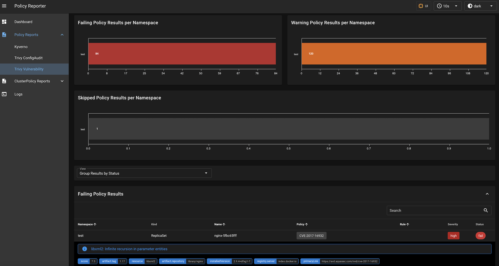
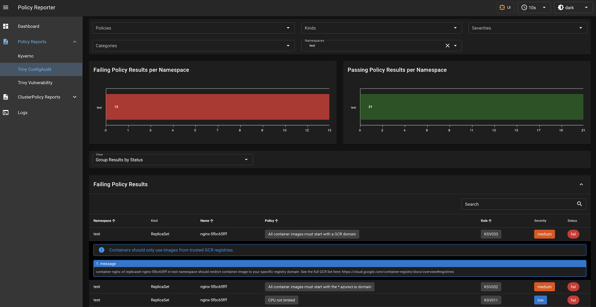

# Policy Reporter Integration

[Policy Reporter](https://kyverno.github.io/policy-reporter/) adds observability and monitoring possibilities to cluster security 
based on the [PolicyReport CRD](https://github.com/kubernetes-sigs/wg-policy-prototypes/tree/master/policy-report), developed by the Kubernetes Policy Working Group.

Key features are:

- New results can be send to [different clients](https://kyverno.github.io/policy-reporter/core/targets) like Grafana Loki, Slack, Discord or MS Teams
- A webbased dashboard to get a graphical overview of all results with optional filters
- E-Mail Reports on a regular basis about the current status of your cluster security
- Provide metrics to observe violations in well known monitoring solutions like Grafana
- Can also be integrated with other tools such as Tracee, Kyverno or Falco

## Integration

With [fjogeleit/trivy-operator-polr-adapter](https://github.com/fjogeleit/trivy-operator-polr-adapter) it is possible to create generalized (Cluster)PolicyReport CRD from the various Trivy Operator CRDs, which allows integration with Policy Reporter.

## Screenshots

### VulnerabilityReports

### ConfigAuditReports

