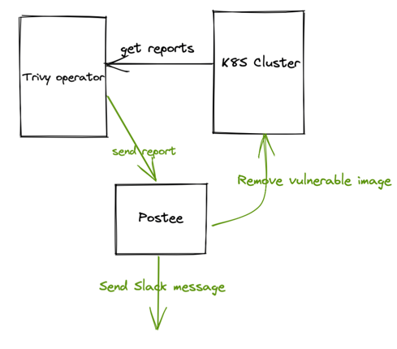

# Webhook Integration

Trivy Operator allows you to send reports externally to a webhook as they get produced. This is useful in cases where you would like to _"set-and-forget"_ the operator and monitor the reports elsewhere. It's also useful when you have to make decisions based on a report, e.g. prune a vulnerable image, remove a deployment with exposed secrets etc.

The latter use case can be fulfilled by using a SOAR tool [Postee](https://github.com/aquasecurity/postee). Out of the box, Postee offers a variety of integrations with other third party services such as ServiceNow, Slack, AWS Security Hub and many more.  

You can enable the Webhook integration as follows:

1. Required: Set `OPERATOR_WEBHOOK_BROADCAST_URL` to the webhook endpoint you'd like to send the reports to.
2. Optional: Set `OPERATOR_WEBHOOK_BROADCAST_TIMEOUT` to a time limit that suites your use case. Default is `30s`.
3. Optional: Set `OPERATOR_SEND_DELETED_REPORTS` to `true` to send webhook notifications when reports are deleted. Default is `false`.

The Webhook integration support the following reports types:

- `vulnerabilityreport`
- `exposedsecretreport`
- `configAuditReport`
- `infraAssessmentReport`
- `rbacAssessmentReport`
- `clusterRbacAssessmentReport`
- `clusterConfigAuditReport`
- `clusterInfraAssessmentReport`
- `clusterComplianceReport`
- `sbomReport`
